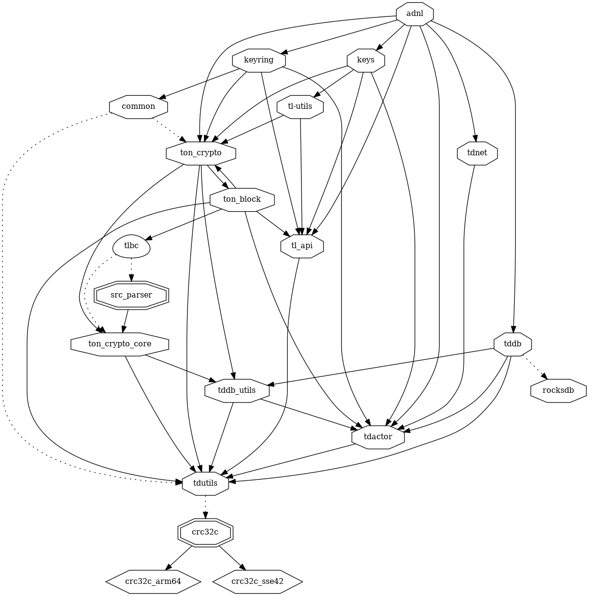
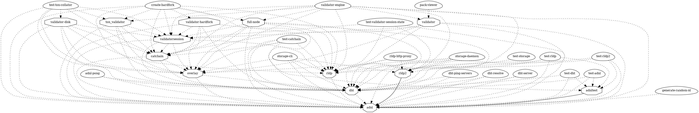
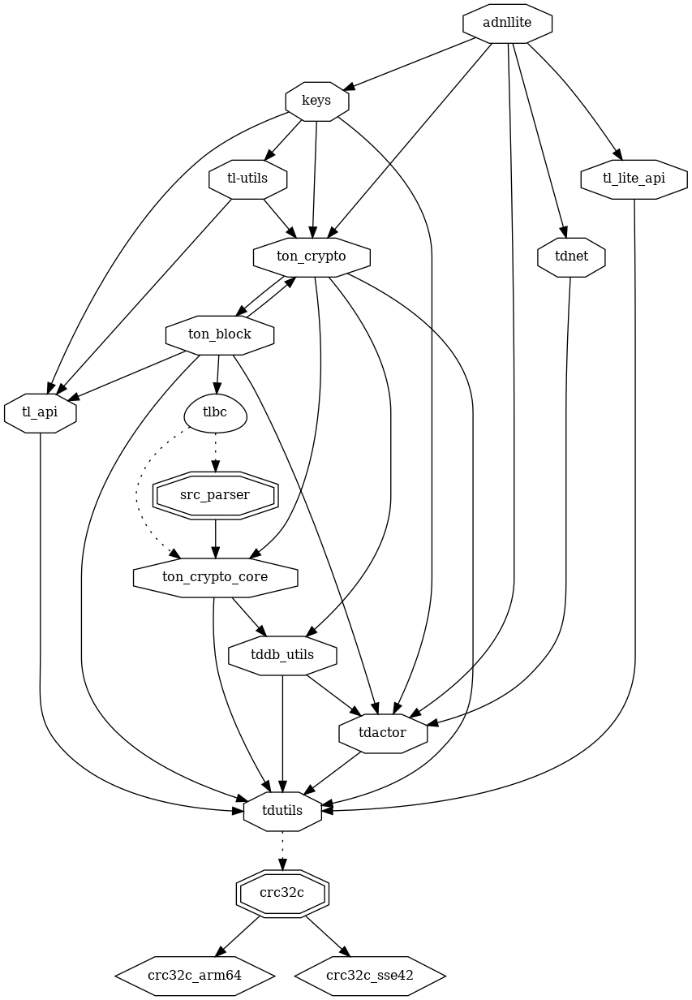
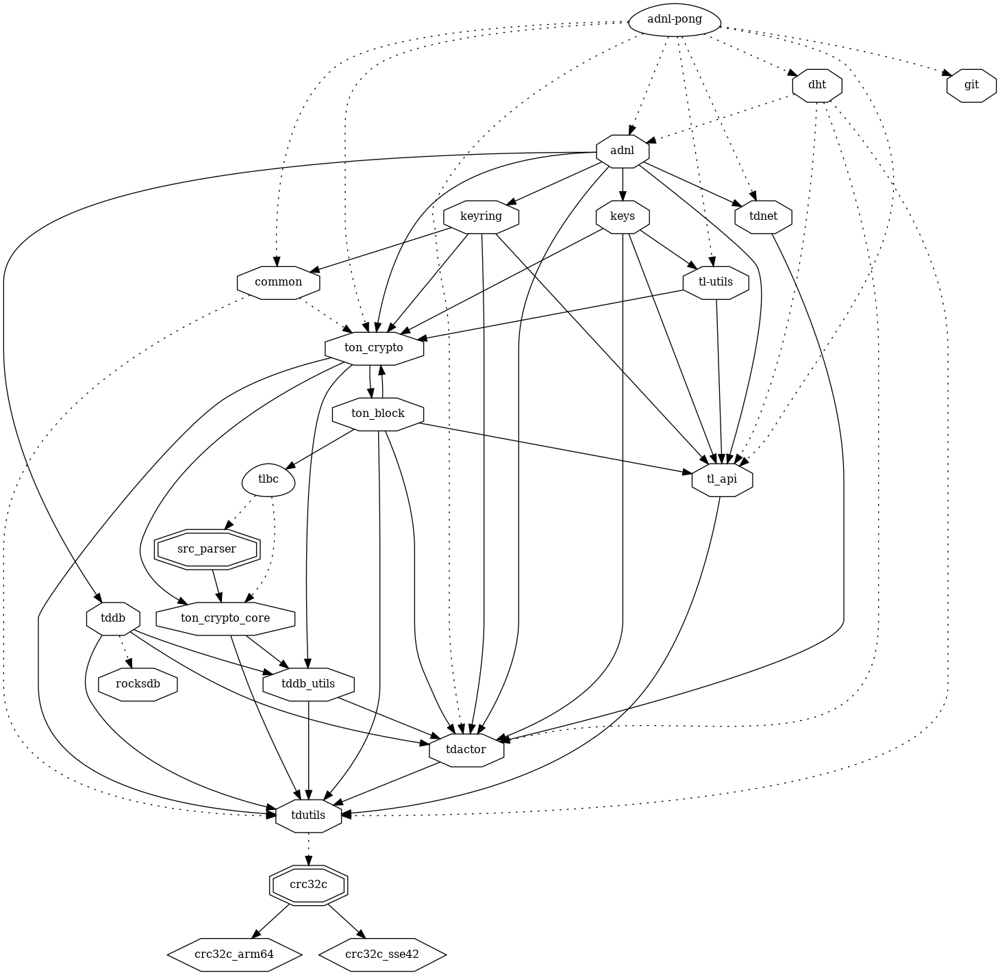
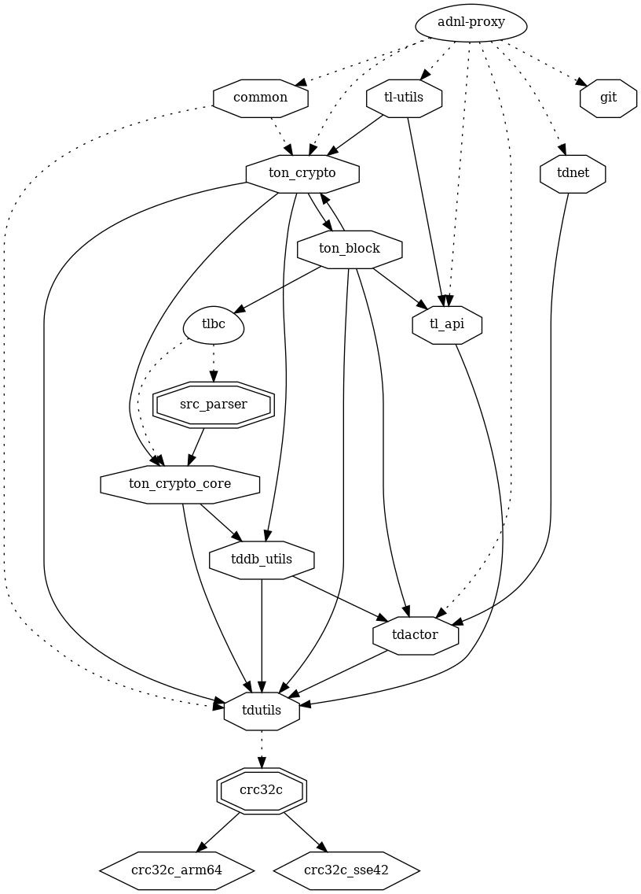
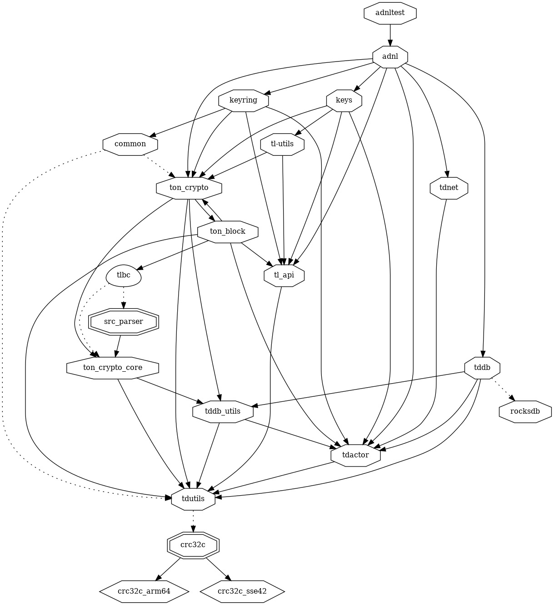

# adnl

> This is the low level protocol on which all interaction in the TON network is built, it can work on top of any protocol, but is most often used on top of TCP and UDP. UDP is used for communication between nodes, and TCP is used for communication with lite servers.

https://docs.ton.org/develop/network/adnl-tcp

## adnl

### adnl dependers

## adnllite

## adnl-pong

## adnl-proxy

## adnltest

