# crypto

Several modules related to cryptography.

## test-ed25519-crypto exe

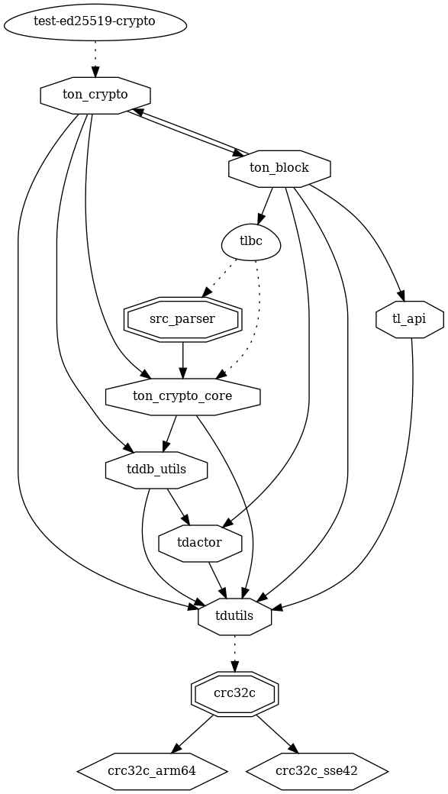

## fift exe

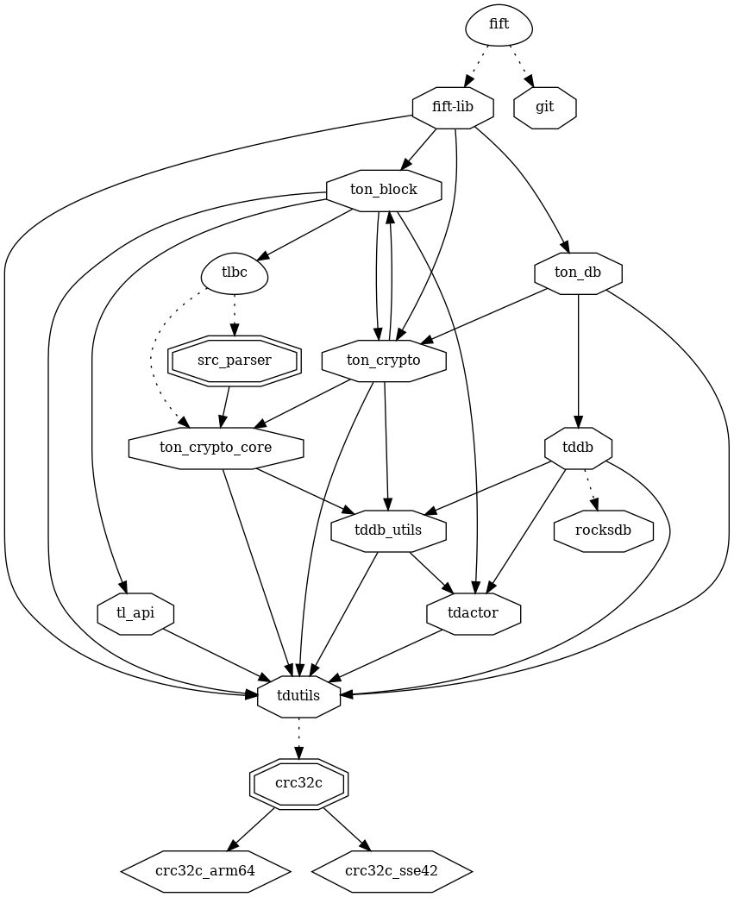

## func exe

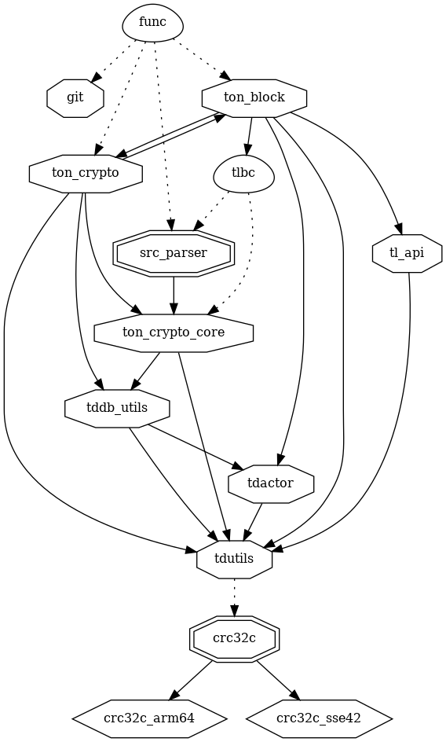

## funcfiftlib exe

## tlbc exe

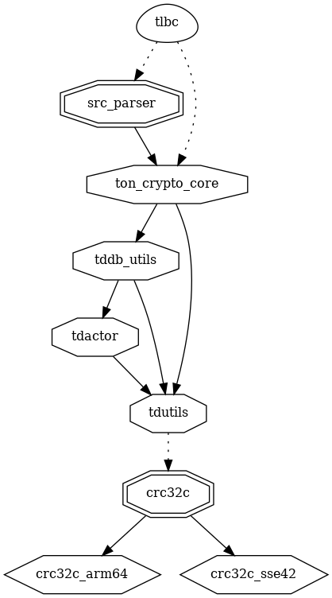

## pow-miner exe

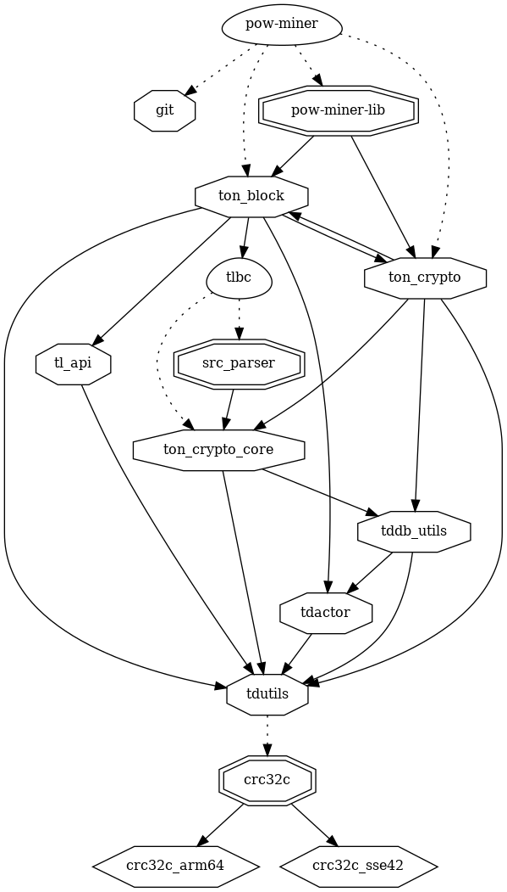

## create-stat exe

## dump-block exe

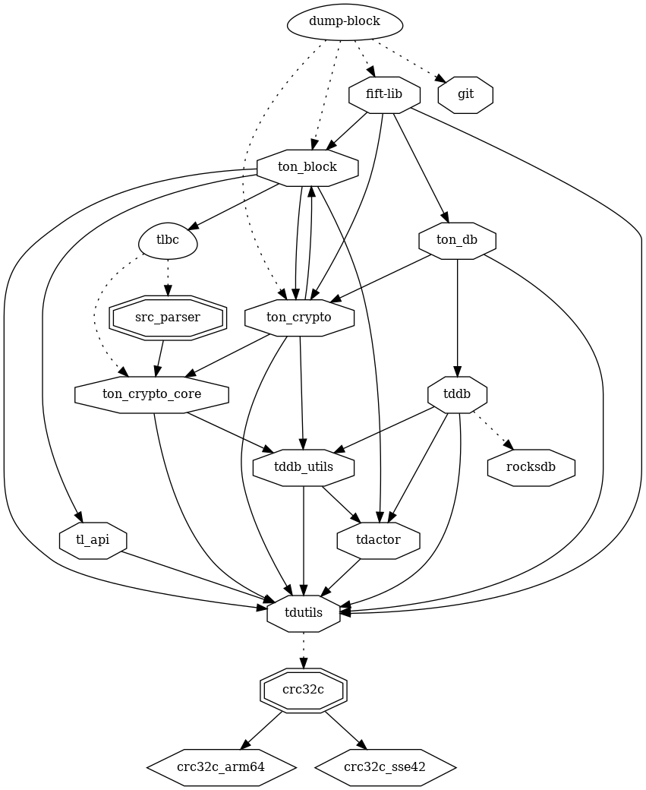

## adjust-block exe

## test-weight-distr exe

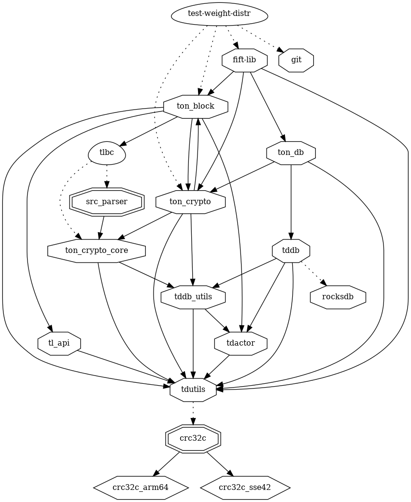

---

## ton_crypto_core lib

### dependencies

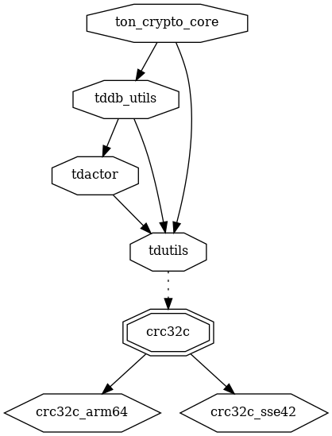

### dependers

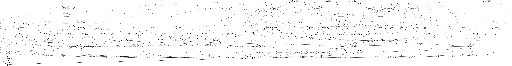

## ton_crypto lib

### dependencies

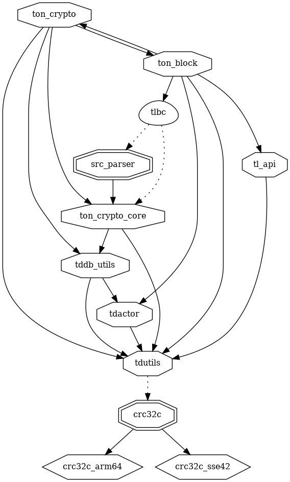

### dependers

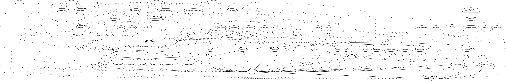

## ton_block lib

### dependencies

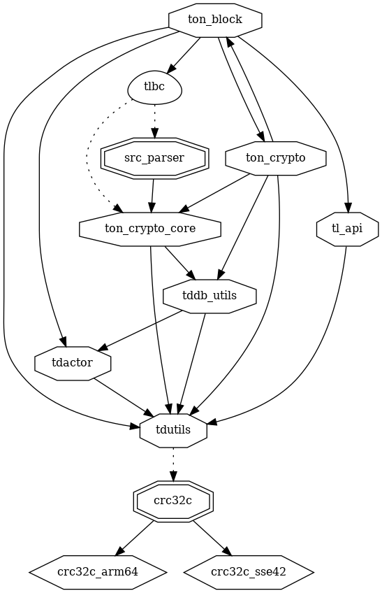

### dependers

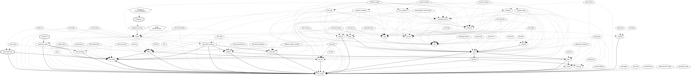

## ton_db lib

### dependencies

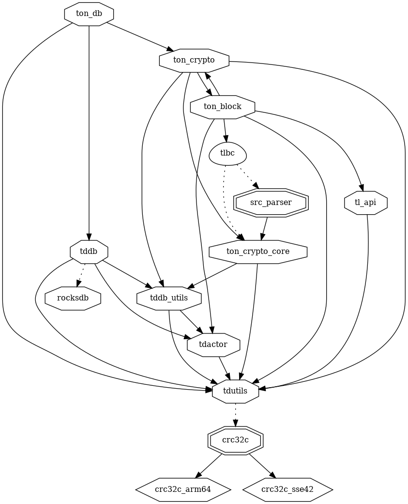

### dependers

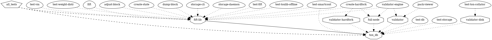

## fift-lib lib

### dependencies

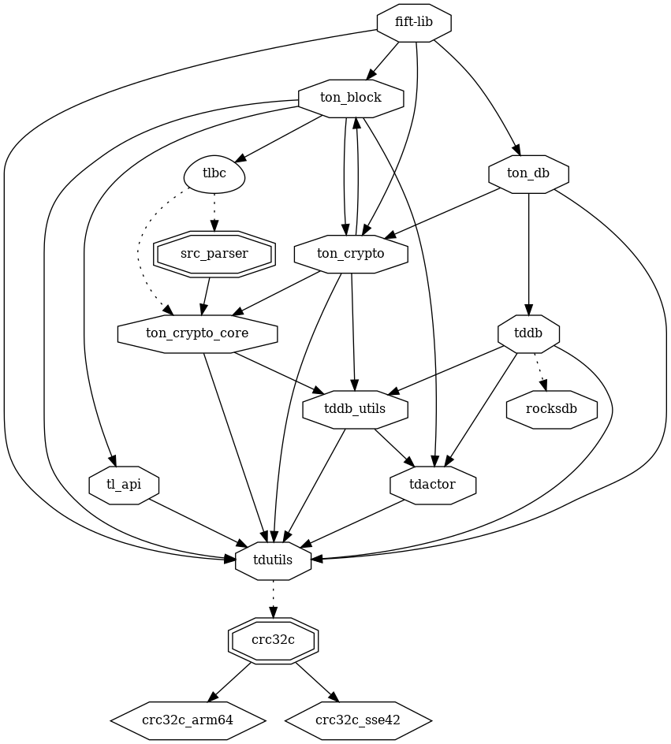

### dependers

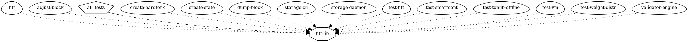

## src_parser lib

### dependencies

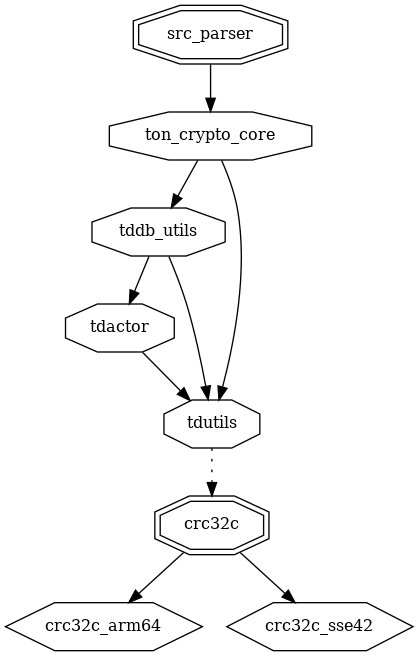

### dependers

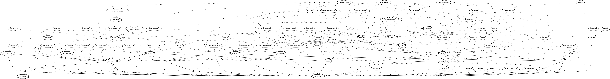

## pow-miner-lib lib

### dependencies

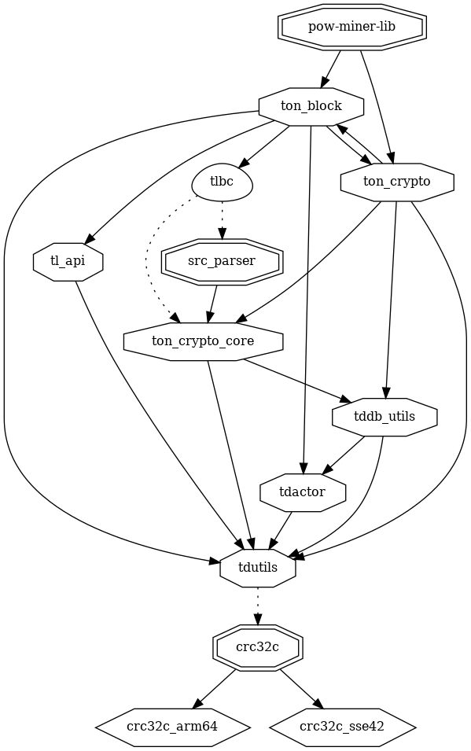

### dependers

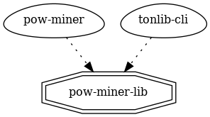

## smc-envelope lib

### dependencies

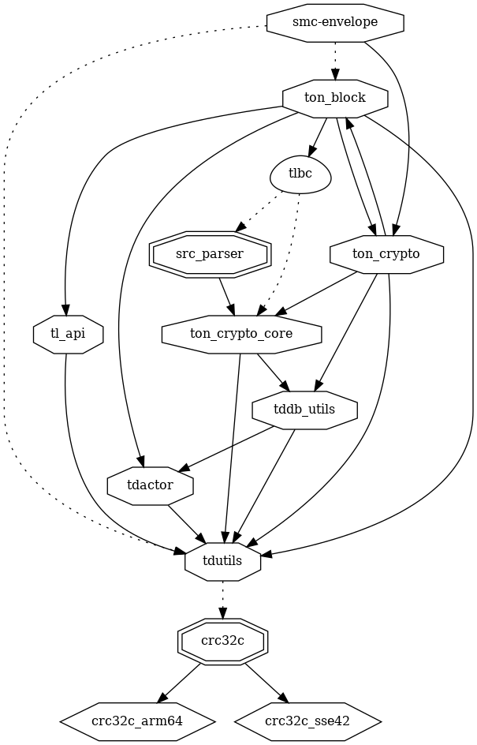

### dependers

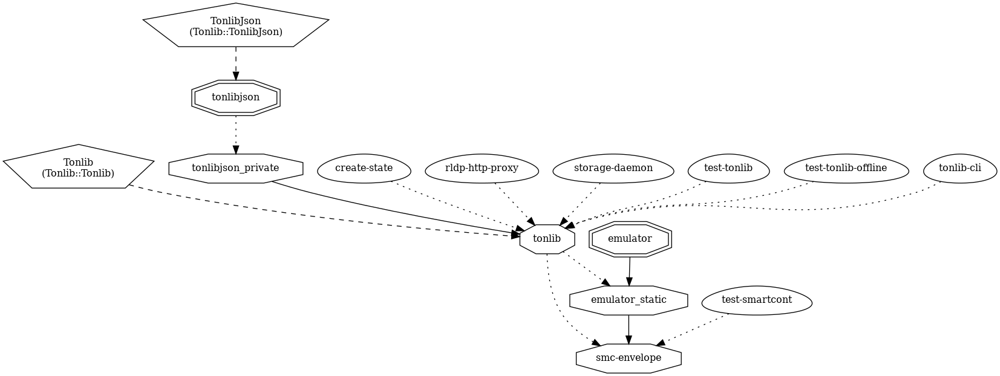
