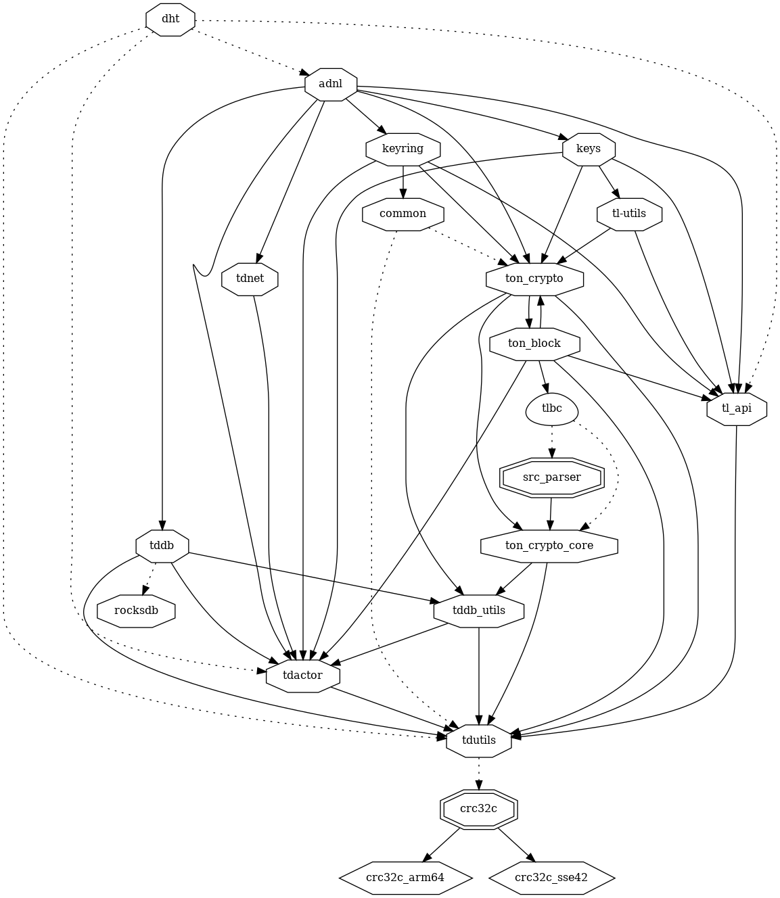
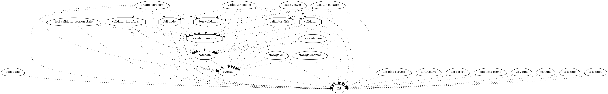
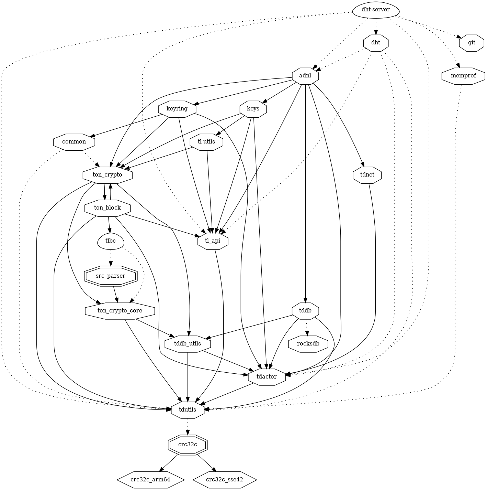
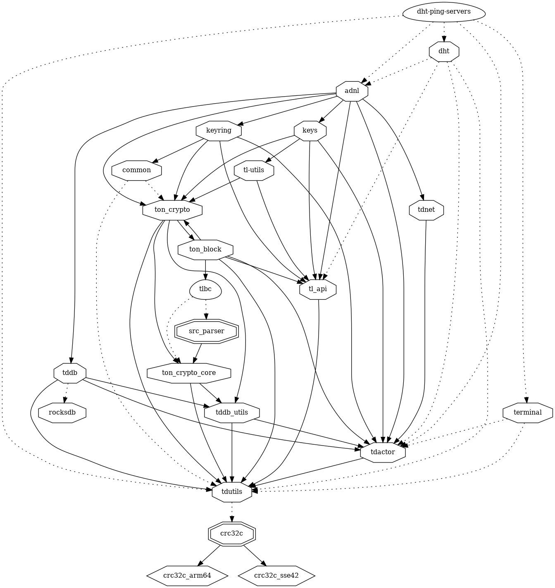

# dht-server

## Distributed Hash Table Server

> The Kademlia-like Distributed Hash Table (DHT) plays a crucial role in the networking part of the TON project and is used to locate other nodes in the network.

https://docs.ton.org/learn/networking/ton-dht

## Submodules

* [dht](dht)

## dht

### dht dependers

## dht-server

## dht-resolve

## dht-ping-servers

