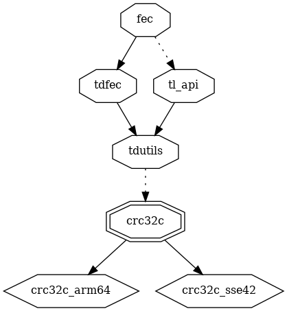
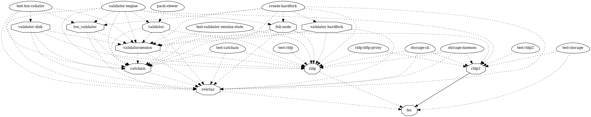

# fec

## Forward Error Correction (FEC)

> Valid Forward Error Correction algorithms for use with RLDP are RoundRobin, Online, and RaptorQ.

https://docs.ton.org/develop/network/rldp#fec

## dependencies

### emulator_static dependers

