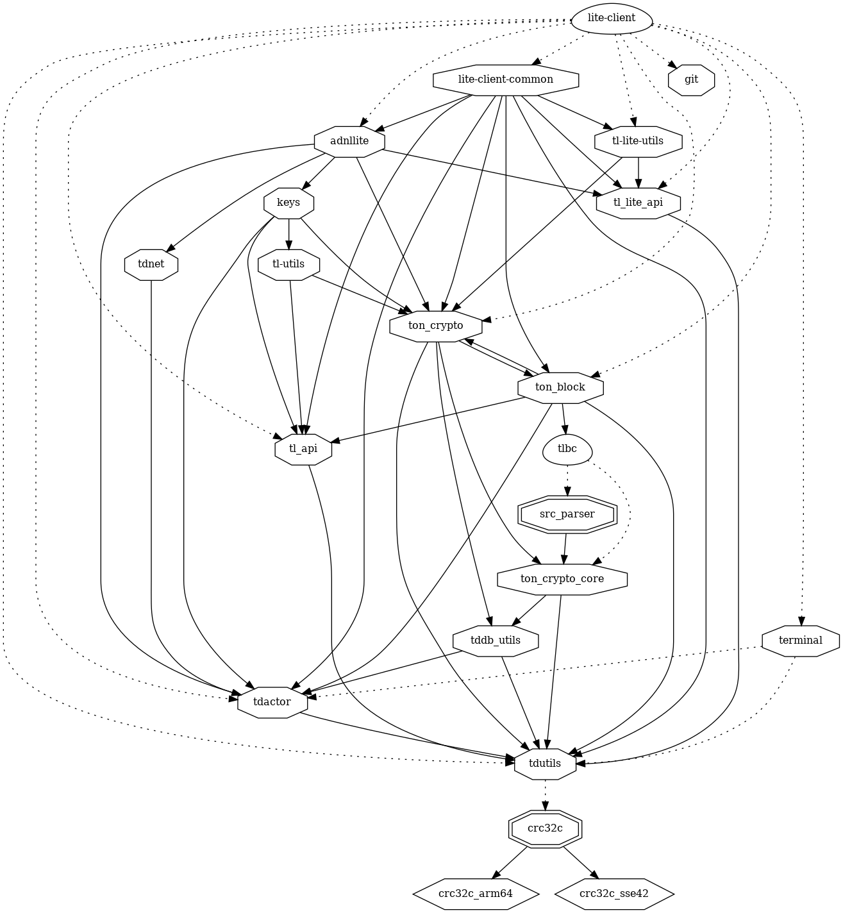
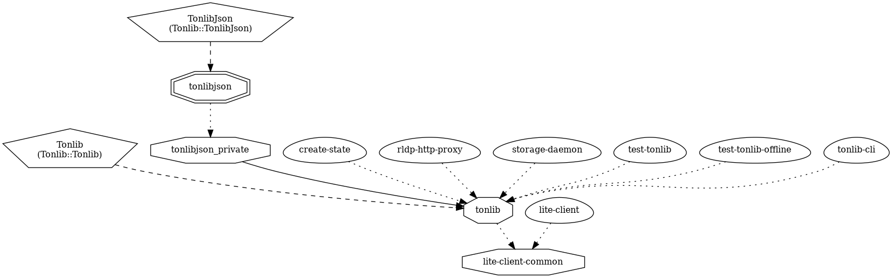

# lite-client

see [lite-client-docs/README.md](lite-client-docs/README.md)

## lite-client exe

### dependencies

## lite-client-common lib

### dependencies

### dependers

### TODO:

consider
- moving lite-client-docs/* into lite-client
- renameing lite-client-docs/README to README.md
