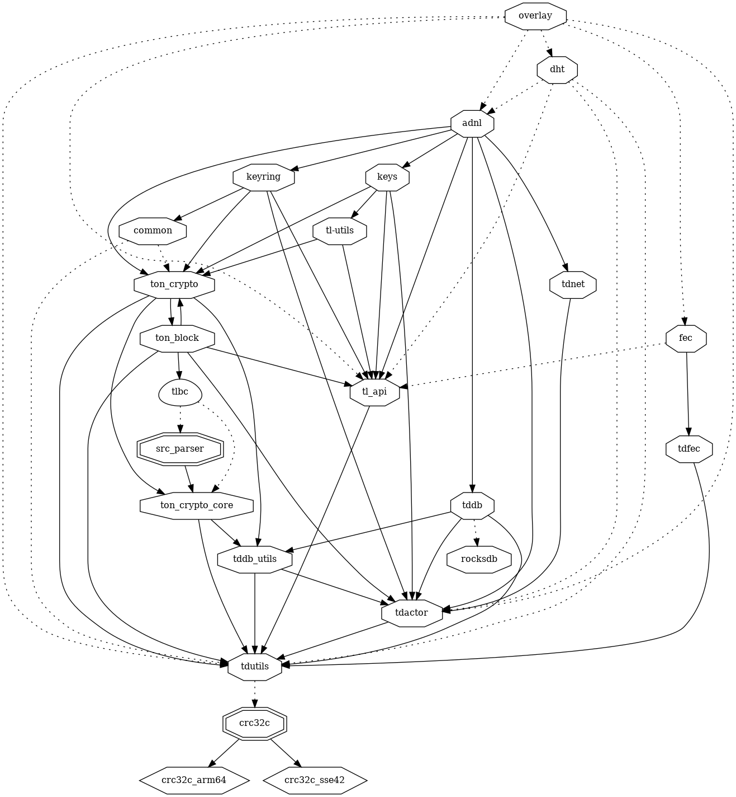
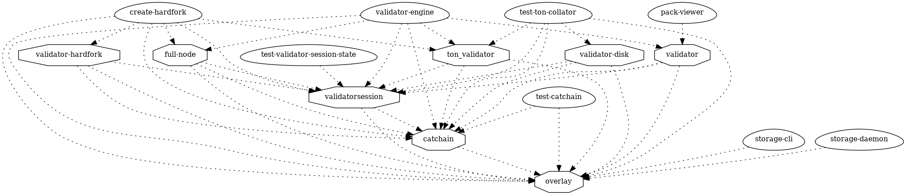

# overlay

> In a multi-blockchain system like TON, even full nodes would usually be interested in obtaining updates (i.e., new blocks) only around a few shardchains. To this end, a special overlay subnetwork has been built inside the TON Network, on top of the ADNL Protocol, for each shardchain.
>
> Also, overlay subnetworks are used for the operation of TON Storage, TON Proxy and so on.

https://docs.ton.org/learn/networking/overlay-subnetworks

## overaly lib

### dependencies

### dependers

