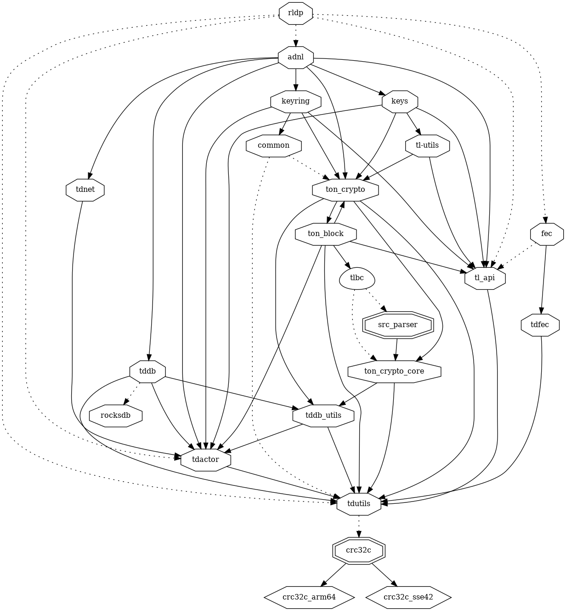
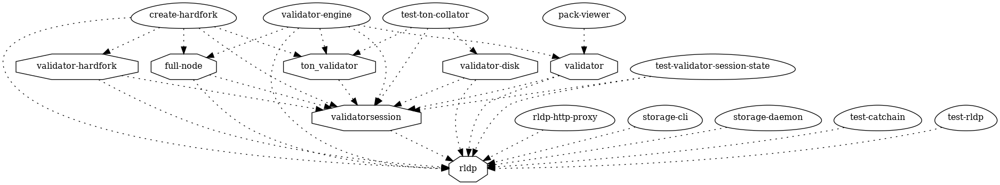

# rldp

> A reliable arbitrary-size datagram protocol built upon the ADNL, called RLDP, is used instead of a TCP-like protocol. This reliable datagram protocol can be employed, for instance, to send RPC queries to remote hosts and receive answers from them.

* https://docs.ton.org/learn/networking/rldp
  * https://docs.ton.org/develop/network/rldp

## Parent Module

* [rldp-http-proxy](rldp-http-proxy)

## rldp lib

### dependencies

### dependers

