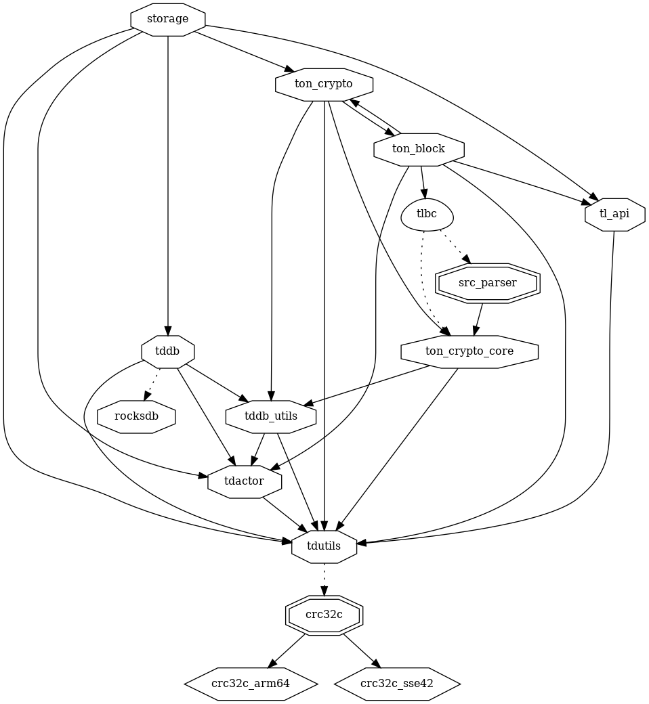
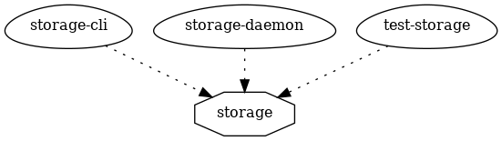
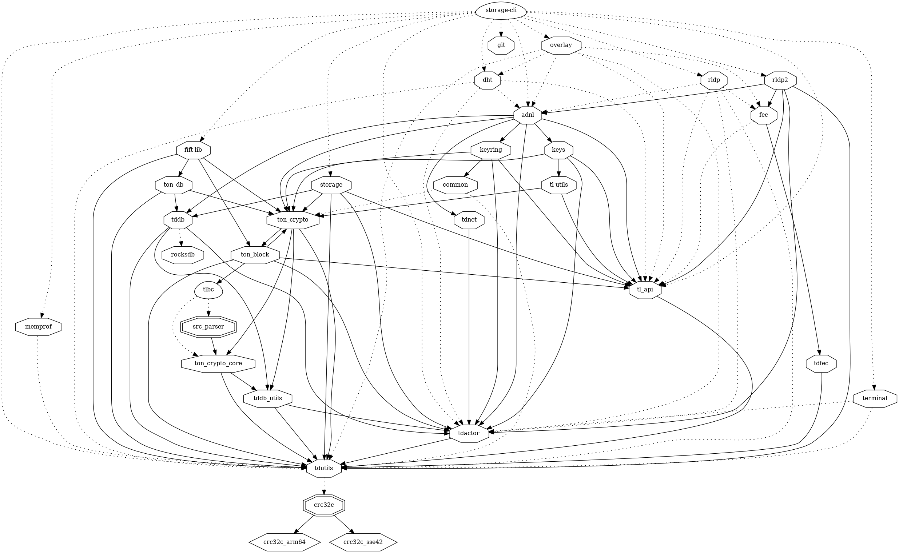
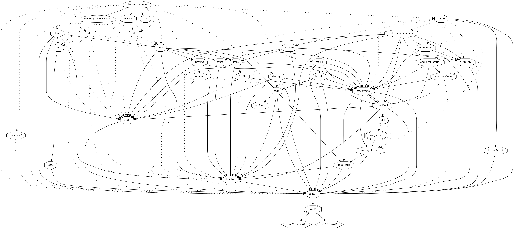
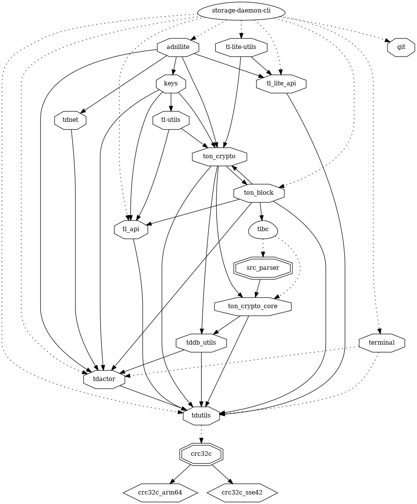

# storage

* [storage-daemon](storage-daemon)
  * [smartcont](smartcont)
* Peer
* Torrent

* https://docs.ton.org/participate/ton-storage/storage-daemon

## storage lib

### dependencies

### dependers

## storage-cli exe

### dependencies

## storage-daemon exe

## storage-daemon-cli exe

