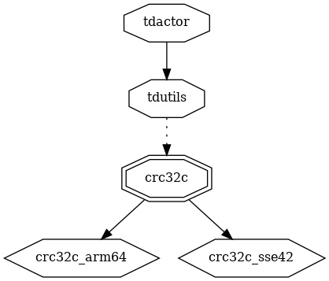
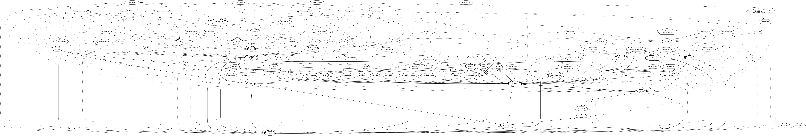

# tdactor

Related to

> Cross-platform library for building Telegram clients

https://github.com/tdlib/td

## Code Units

* [tdactor](tdactor) (this)
* [tddb](tddb)
* [tdfec](tdfec)
* [tdnet](tdnet)
* [tdtl](tdtl)
* [tdutils](tdutils)

## tdactor lib

### dependencies

### dependers

