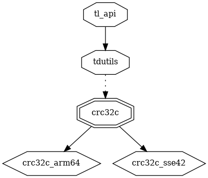
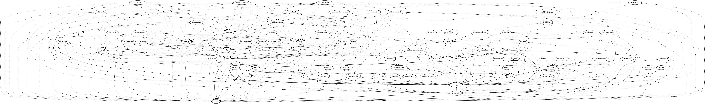
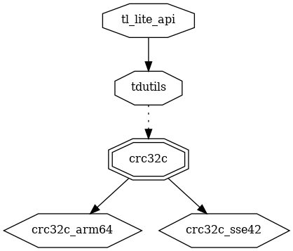
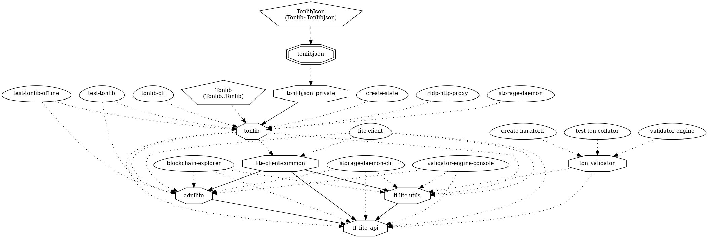
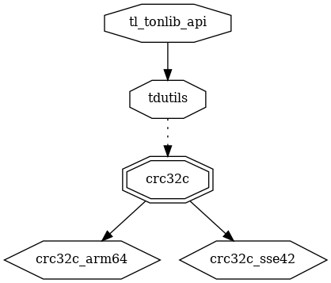
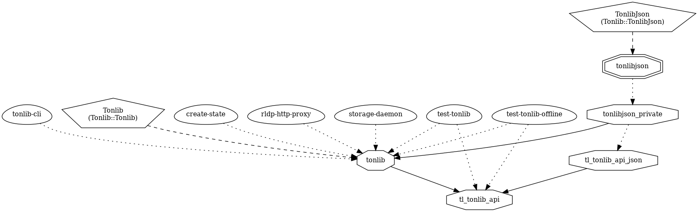
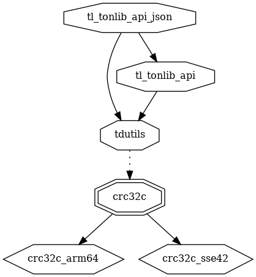
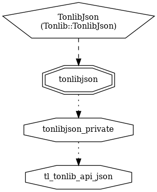

# tl

Type Language

* https://docs.ton.org/develop/data-formats/tl
  * https://core.telegram.org/mtproto/TL

## tl_api lib

### dependencies

### dependers

## tl_lite_api lib

### dependencies

### dependers

## tl_tonlib_api lib

### dependencies

### dependers

## tl_tonlib_api_json lib

### dependencies

### dependers

## Further Code
* [tl-utils](tlutils)
