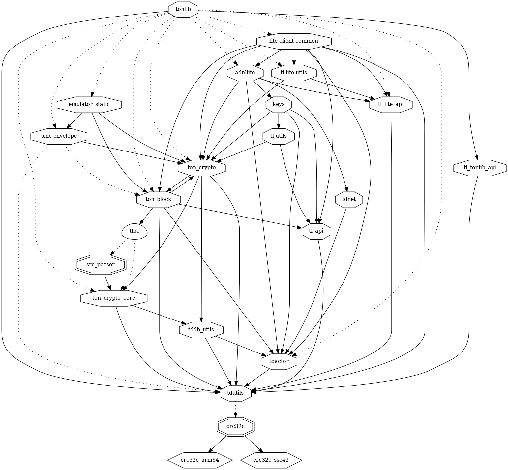
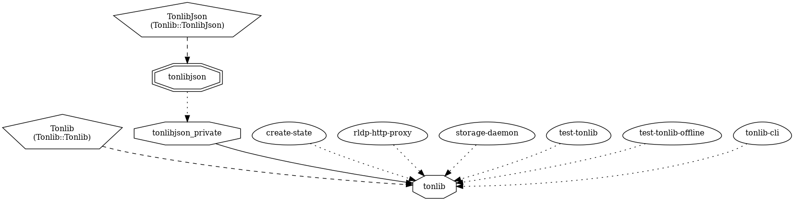
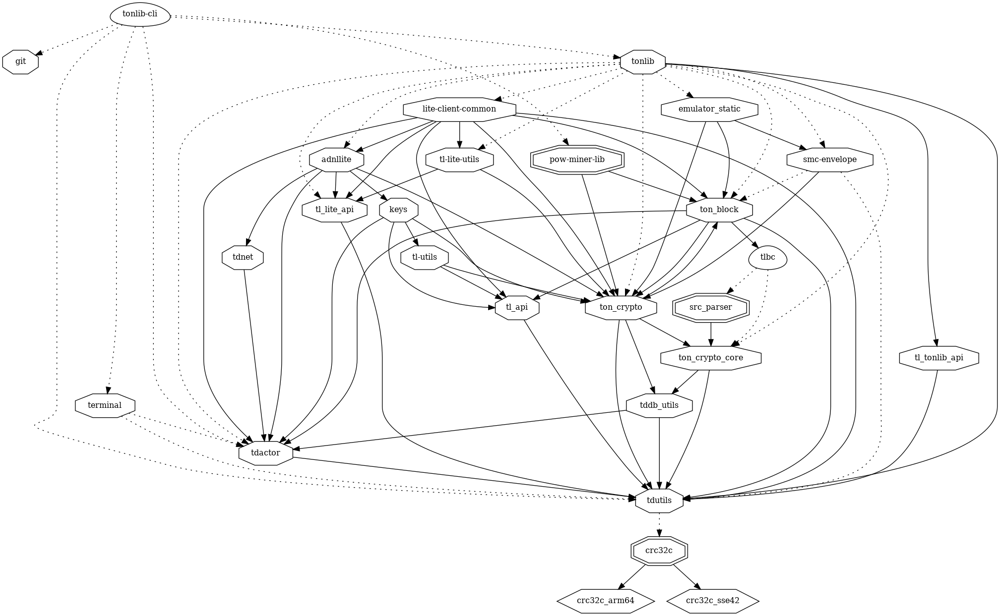
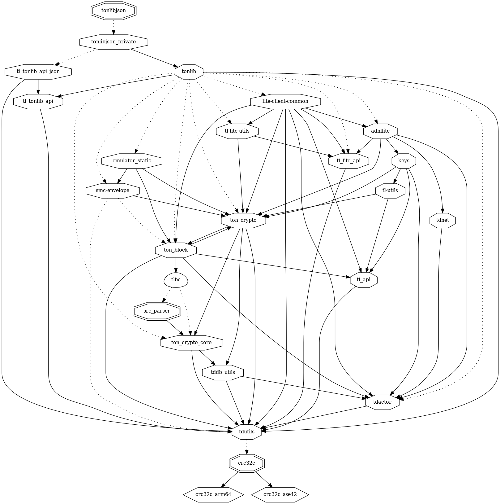
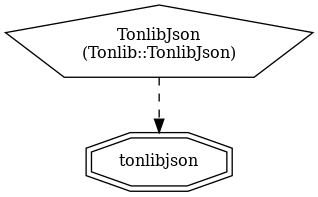
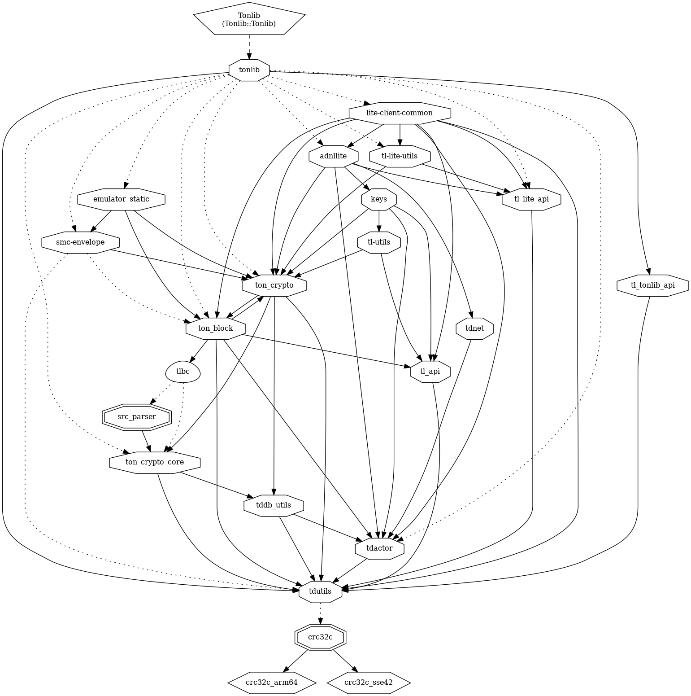
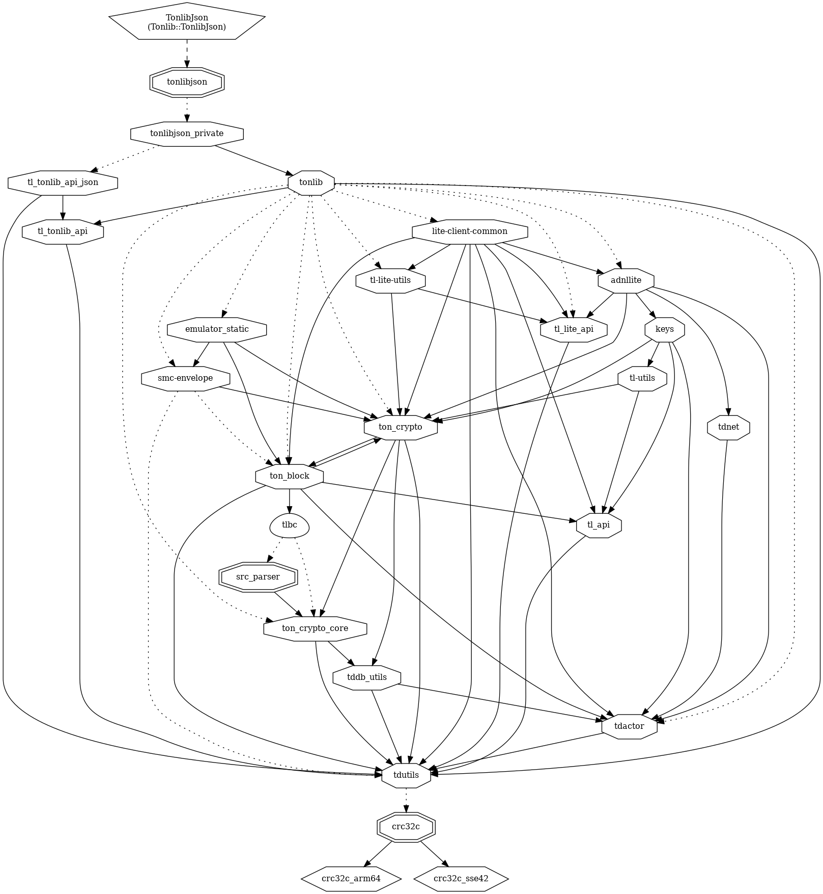

# tonlib

> ! LOW-LEVEL
These technologies contain very low-level stack, so please use it only if any other SDKs won't work for you. It will save a lot of your time.

[Legacy TonLib SDK](https://docs.ton.org/develop/dapps/apis/sdk#legacy-tonlib-sdk)

[Tonlib C++ basic usage examples](https://github.com/ton-blockchain/ton/tree/master/example/cpp)

## tonlib lib

### dependencies

### dependers

## tonlib-cli exe

## tonlibjson lib

### dependencies

### dependers

## Tonlib 

## TonlibJson

