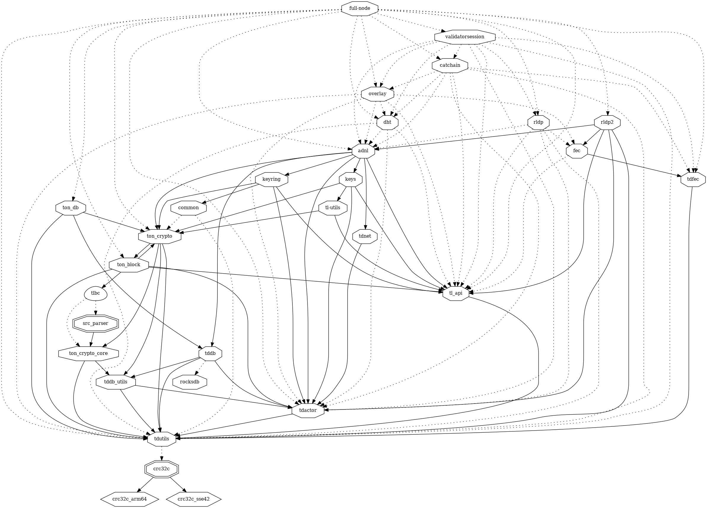
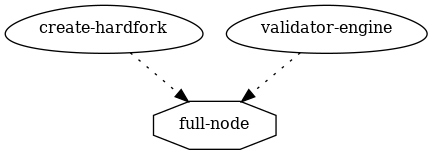
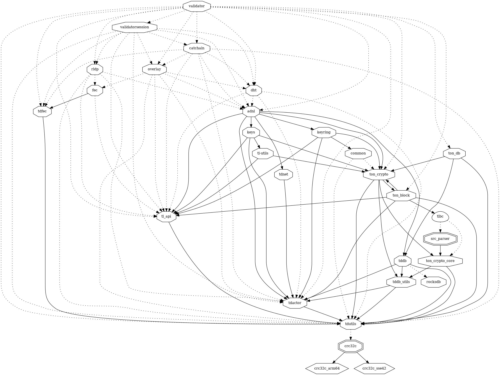
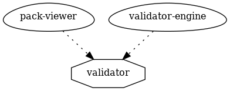
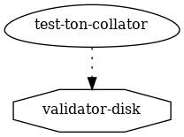
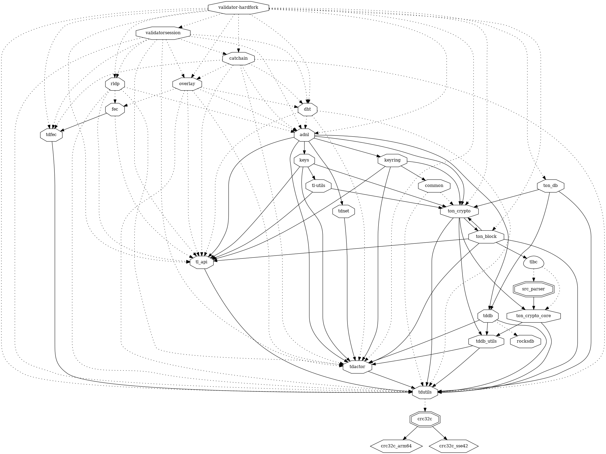
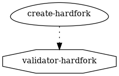

# validator

A TON Validator Node Implementation

## full-node lib

### dependencies

### dependers

## validator lib

### dependencies

### dependers

## validator-disk lib

### dependencies

### dependers

## validator-hardfork lib

### dependencies

### dependers

